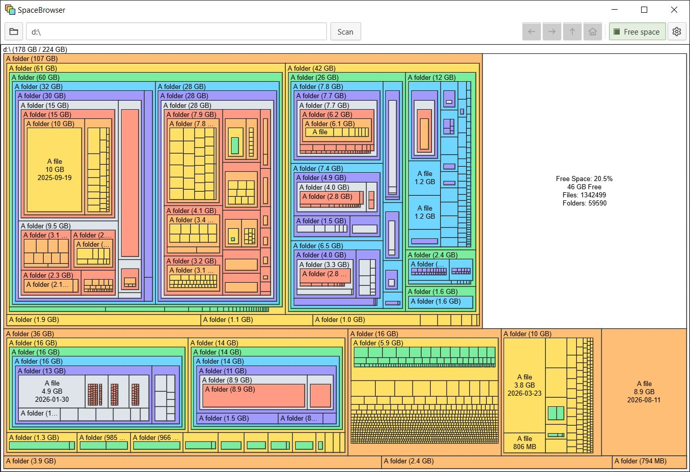

<p align="center">
  
</p>

<h1 align="center">SpaceBrowser</h1>

<p align="center">
  Cross-platform disk space visualizer
</p>

<br>

SpaceBrowser scans a folder or volume and displays its contents as a size-proportional [treemap](https://en.wikipedia.org/wiki/Treemapping), making large files and directories easy to identify.

Inspired by [SpaceMonger 1.4](https://github.com/seanofw/spacemonger1), SpaceBrowser is a free, cross-platform, open-source disk space analyzer and an alternative to WinDirStat, WizTree, TreeSize, DaisyDisk, and SquirrelDisk

<br>



## Features

SpaceBrowser recreates the main features of SpaceMonger 1.4 in a modern, cross-platform application.

### Visualization and scanning

- Size-proportional treemap for files and folders
- Optional free-space node for scanned volumes
- Configurable small-file aggregation threshold
- Live scan progress, time estimate, and cancellation
- Terminal report for skipped paths and filesystem or metadata errors
- Exclusions for paths, hidden files, symlinks, and network filesystems

### Navigation and actions

- Treemap navigation with Back, Forward, Parent, and Root commands
- Hover details with full path, byte size, modification date, and system icon
- Open, Open with, and filesystem Properties actions
- Optional move-to-trash command with confirmation and rescan

### Customization

- Rectangle color palettes, scale, shape and shading
- Rebindable keyboard shortcuts
- Persistent settings

### Platforms

- Windows and Linux support
- macOS build available but not yet tested


## Usage

Prebuilt versions for Windows, macOS, and Linux are available on the [Releases page](https://github.com/Kiord/SpaceBrowser/releases). Download the file for your platform and run it directly.

SpaceBrowser can be launched in a terminal, see `--help`.

To build SpaceBrowser from source, install Go 1.25 and the [Wails v2 development dependencies](https://wails.io/docs/gettingstarted/installation/), then run:

```sh
git clone https://github.com/Kiord/SpaceBrowser.git
cd SpaceBrowser
go install github.com/wailsapp/wails/v2/cmd/wails@v2.13.0
```

Build the application with:

```sh
wails build
```

For development with automatic reloads, use:

```sh
wails dev
```

Pass application arguments through Wails during development with `-appargs`, for example:

```sh
wails dev -appargs '"C:\Users" -v 4'
```

## Trigger a new release

Create and push a version tag. The release build derives its version from the tag:

```sh
git tag -a vX.X.X -m "Release vX.X.X"
git push origin vX.X.X
```
